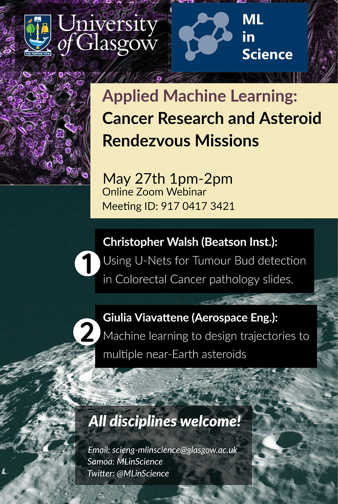

# 
 Click the poster to view the video 

<i>
 Note that the talk on <b>"Responding to disasters and enhancing 3D images with  synthetic datasets"</b> is in two parts. The link for part 2 is under the poster image.

</i>

<table style="width:100%">
    <tr>
        <td>
            

          
<!--                 
<a href="slides1.html">click here for slides</a>
 -->
            

        </td>
        <td>
            

              
            

        </td>
        <td>
            

              
            

        </td>
    <tr>
        <td>
            

              <a href="https://youtu.be/IXPga5pNBvQ" title="Disasters talk">
                
                  <b>
<a href="https://youtu.be/IXPga5pNBvQ">Part1: Alex Hepburn</a>

                      
<a href="https://youtu.be/3h3z5XfYYY0">Part2: Xiao Gu</a>
</b>
              </a>
            

        </td>
        <td>
            

              
            

        </td>
</table>
    

